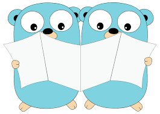

# Learning Go

## Introduction

This repository contains a series of challenges to learn Go in an incremental way. Each challenge will introduce
new concepts such as struct, testing, data persistence, etc. Furthermore, each challenge will be built on top of the
previous ones, so it is not recommended to try Challenge #2 without completing Challenge #1.

By the end of this series of challenges, we will have a minimal project that will expose a REST API, persist data in
a database and consume some domain events from Kafka in a docker environment.

Disclaimer: This is not intended to teach Go, but to allow us, developers, to have a safe pet project in which
we can validate and put into practice our learnings regarding Go and its ecosystem. So look at this repository as a
coding dojo 🥷.

To take a look at other resources to learn go, please go to: 
https://confluence.mpi-internal.com/display/LHP/Backend+onboarding+resources

## Challenges

As it was mentioned earlier, here you can find a series of incremental challenges to practice coding with Go and its
ecosystem. In the `challenges` directory you can find a complete list of the challenges and their instructions. At the
moment the available challenges are:

### Challenge #1. Visibility in Go, structs and data structures

In this challenge we are going to work on how Go handles visibility by creating our first module and packages. 
Furthermore, we will define our first structs and data structures (arrays, maps and slices).

### Challenge #2. Error handling and testing

In this second challenge we are going to practice with error handling and adding the first test suites to test 
the pieces of code which we have been working on until now.