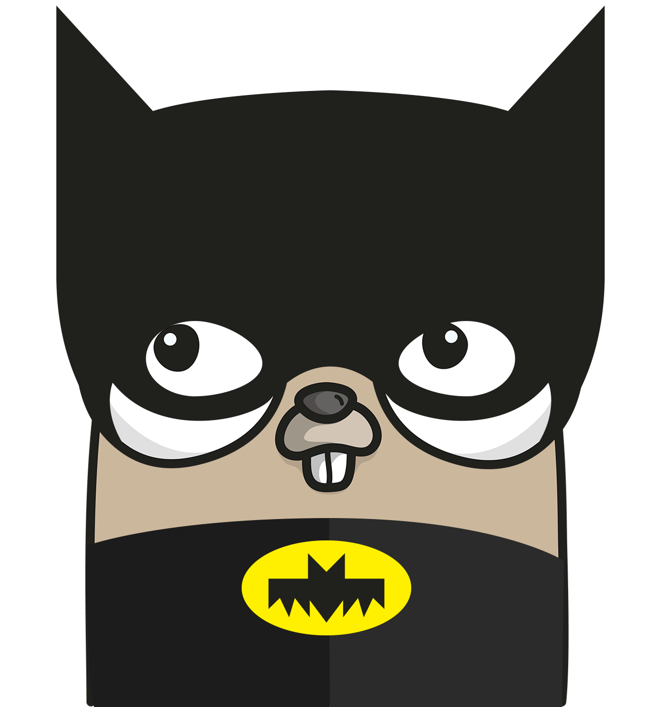

    

<h1 align="center" style="text-align: center;">
  Challenge #4. Dockerizing our app and using a real database
</h1>

In this new challenge we are going to dockerize our app and to replace our in-memory repository with an implementation
based on a real database (like PostreSQL). So let's do it!

## Instructions

### Dockerizing our app

Our first goal will be to dockerize our app to get it production ready. To do that, we are going to need a Dockerfile
that builds the necessary binary files and use them to run our application: https://docs.docker.com/language/golang/build-images/

Next step is to create the Docker image and run it. We can do it manually, or we can define a `docker-compose` file (which
would be great, since later we will need to dockerize our database too). 

In any case, the last step should be to allow configuring our app externally by using environment variables to set, for
example, the port and the host in which our app will run. To do that we can use the Go standard library (https://gobyexample.com/environment-variables)
or any third party dependency like `envconfig` (https://github.com/kelseyhightower/envconfig) or `viper` (https://github.com/spf13/viper).

### Adding a real database

At this point we want to get our app production ready, and we need a real database in which store our ads. To do that, we
are going to replace our in-memory repository implementation with an implementation that relies on a PostgreSQL database.

We are going to need to add to our `docker-compose` a new PostgreSQL container and to pass to our app all the connection
data required to connect with the container via environment variables.

To implement the repository we are going to use the standard library `database/sql` with the PostgreSQL driver 
(https://github.com/lib/pq). Some examples here: https://go.dev/doc/tutorial/database-access
Don't forget to add some integration tests to the new repository's implementation to ensure that it works as expected! 🚀

## Resources
1. How to do dockerize a Go application: https://docs.docker.com/language/golang/build-images/
2. How to read environment variables using the Go standard library https://gobyexample.com/environment-variables
3. Third party library to handle environment variables: https://github.com/kelseyhightower/envconfig
4. Third party library to handle configuration (including environment variables): https://github.com/spf13/viper
5. Official Go tutorial about connecting and querying a database: https://go.dev/doc/tutorial/database-access
6. Connecting to a PostgreSQL database: https://www.calhoun.io/connecting-to-a-postgresql-database-with-gos-database-sql-package/
7. Saving structures in database: https://raw.githubusercontent.com/richyen/toolbox/master/pg/orm/gorm_demo/gorm_demo.go
